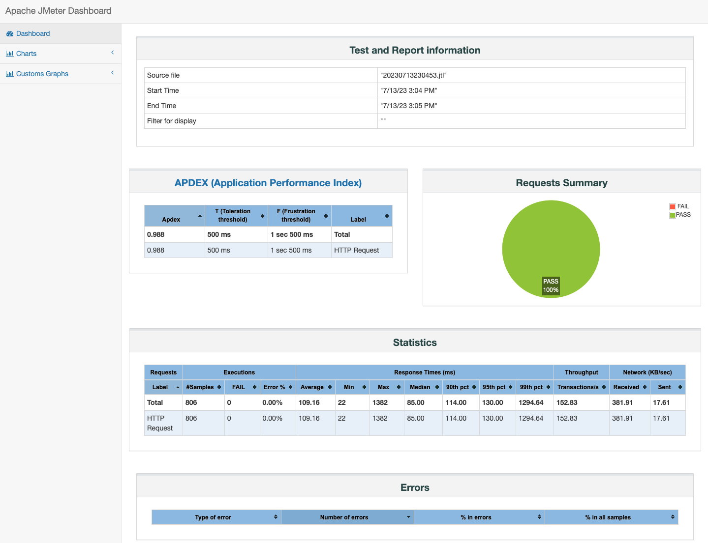

# docker-jmeter


## 构建镜像

* 构建 master 镜像

```bash
$ cd master
$ bash ./build.sh

[+] Building 340.5s (9/9) FINISHED                                                                                                                           
...
 => => naming to docker.io/defnngj/jmeter-master:5.5
```

* 构建 slave 镜像

```bash
$ cd slave
$ bash ./build.sh

[+] Building 1.4s (7/7) FINISHED                                                                                                                               
...
 => => naming to docker.io/defnngj/jmeter-slave:5.5 
```

* 查看镜像

```bash
$ docker images

REPOSITORY              TAG    IMAGE ID       CREATED          SIZE
defnngj/jmeter-slave    5.5    9e5c9141fcc4   19 minutes ago   672MB
defnngj/jmeter-master   5.5    c4a2eab57be7   19 minutes ago   673MB
```

* `c4a2eab57be7` master 镜像ID, 后面要用。

## 运行

* 启动 slave 节点。

假设有两台主机，可以启动两个slave。

```bash
$ docker run -it -d --name slave_a runcare/jmeter-slave
$ docker run -it -d --name slave_b runcare/jmeter-slave
```

* 查看启动的容器

```bash
$ docker ps

CONTAINER ID   IMAGE                      COMMAND                   CREATED         STATUS         PORTS                 NAMES
57b70df37adb   defnngj/jmeter-slave:5.5   "/bin/sh -c 'jmeter-…"   7 minutes ago   Up 7 minutes   1099/tcp, 60001/tcp   slave_b
2c4c3e6b9b26   defnngj/jmeter-slave:5.5   "/bin/sh -c 'jmeter-…"   7 minutes ago   Up 7 minutes   1099/tcp, 60001/tcp   slave_a
```

* 查看两个slave 的IP 地址

```bash
$ docker inspect -f '{{ .Name }} => {{ .NetworkSettings.IPAddress }}' $(docker ps -q)

/slave_b => 172.17.0.5
/slave_a => 172.17.0.4
```

* 发送压测脚本到 slave

```bash
$ result=`date +"%Y%m%d%H%M%S"` && docker run --rm -v /Users/fnngj/zhpro/script:/data c4a2eab57be7 jmeter -n -t /data/baidu_script.jmx -l /data/$result.jtl -j /data/$result.log -e -o /data/$result -R 172.17.0.4,172.17.0.5
```

__参数说明__

`result=`date +"%Y%m%d%H%M%S"`: 指定测试结果的名称，以当前日期时间命名。

`/Users/fnngj/zhpro/script` : 压测脚本的目录，测试结果也会存放到该目录下。

`baidu_script.jmx` : 压测脚本的名称，存放于 `/Users/name/zhpro/script`目录下。 参考[script/](/script/)) 目录下。

`c4a2eab57be7` : jmeter-master 的镜像ID。

`172.17.0.4,172.17.0.5` ： 两台 slave 的IP 地址。


### 测试结果

* 执行完的目录

```bash
$ pwd
/Users/fnngj/zhpro/script

$ ll
drwxr-xr-x  6 fnngj  staff   192B  7 13 23:05 20230713230453
-rw-r--r--  1 fnngj  staff    96K  7 13 23:05 20230713230453.jtl
-rw-r--r--  1 fnngj  staff    21K  7 13 23:05 20230713230453.log
-rw-r--r--  1 fnngj  staff   5.4K  7  6 23:55 baidu_script.jmx
```

* 查看报告

进入`20230713230453` 目录，点击 index.html 文件，可以看到压测的结果。


