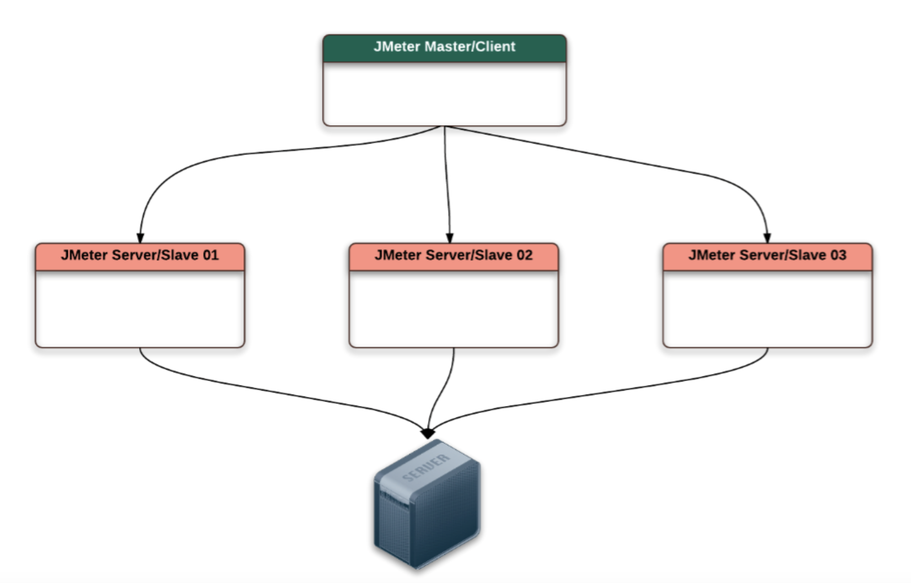
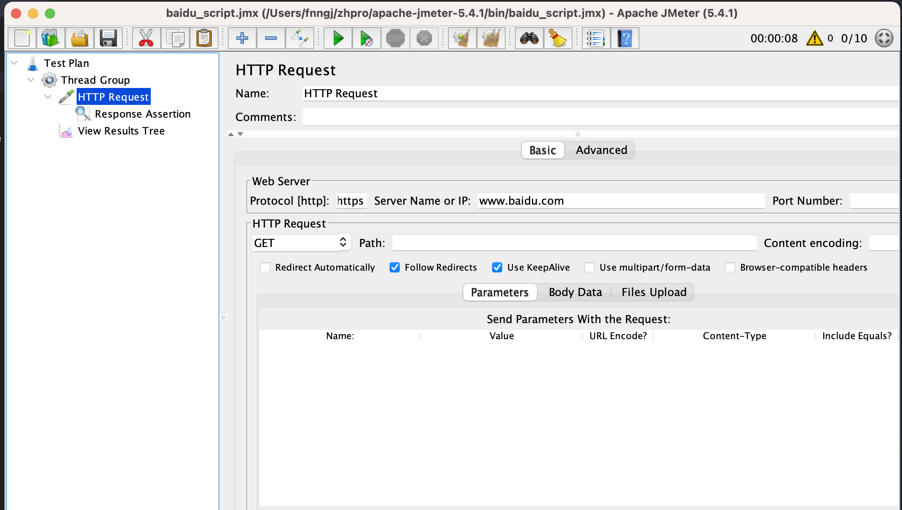
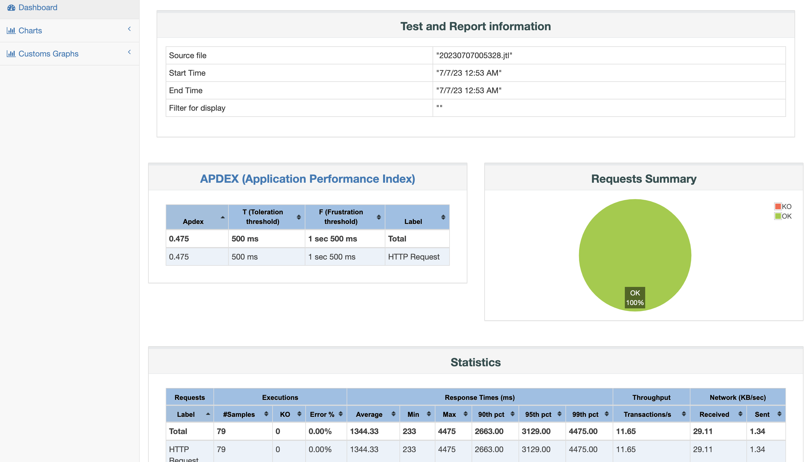

## 利用 docker 实现JMeter分布式压测

### 为什么需要分布式？

在工作中经常需要对一些关键接口做高QPS的压测，JMeter是由Java 语言开发，没创建一个线程（虚拟用户），JVM默认会为每个线程分配1M的堆栈内存空间。受限于单台试压机的配置很难实现太高的并发。所以，通过JMeter实现分布式，可以整合多台主机的硬件资源，实现同时对被测试接口进行压力测试。



Jmeter分布式测试环境中有两个角色：Master 和 Slaves

* Master节点：向参与的Slaves节点发送测试脚本，并聚合Agent节点的执行结果。

* Slaves节点：接收并执行Master节点发送过来的测试脚本，并将执行结果返回给Master。


### 为什么要使用docker? 

如果要分布式联动每台主机，就要求每台主机都要有JMeter环境（JDK + JMeter），如果利用docker就可以通过docker管理 JMeter环境，简单的拉取镜像，启动容器即可。进一步讲，利用k8s、云服务可以无限的扩容JMeter试压机，理论上多少的并发用户都可以模拟。

### 准备工作

* JDK：启动 JMeter 工具需要

```bash
$ brew install openjdk@11
```

* JMeter: 编写JMeter脚本

https://archive.apache.org/dist/jmeter/binaries/

编写一个简单的脚本。



* docker: 通过doker创建容器。

```bash
$ docker pull runcare/jmeter-master
$ docker pull runcare/jmeter-slave
```

* 查看docker镜像

```bash
$ docker images

REPOSITORY              TAG        IMAGE ID       CREATED         SIZE
runcare/jmeter-master   latest     e052a8cd8680   3 years ago     326MB
runcare/jmeter-slave    latest     05c7ba96d97d   3 years ago     326MB
```

请记住 jmeter-master 的镜像ID `e052a8cd8680`，后面会用到。


### 分布式压测使用

* 启动 slave 节点。

假设有两台主机，可以启动两个slave。

```bash
$ docker run -it -d --name slave01 runcare/jmeter-slave
$ docker run -it -d --name slave02 runcare/jmeter-slave
```


* 查看启动的容器

```bash
$ docker ps

CONTAINER ID   IMAGE                  COMMAND                   CREATED             STATUS             PORTS                 NAMES
b270636a7741   runcare/jmeter-slave   "/bin/sh -c 'jmeter-…"   43 seconds ago      Up 42 seconds      1099/tcp, 60001/tcp   slave01
2584c7fef5f8   runcare/jmeter-slave   "/bin/sh -c 'jmeter-…"   52 seconds ago      Up 50 seconds      1099/tcp, 60001/tcp   slave02
```

* 查看两个slave 的IP 地址

```bash
$ docker inspect -f '{{ .Name }} => {{ .NetworkSettings.IPAddress }}' $(docker ps -q)

/slave01 => 172.17.0.3
/slave02 => 172.17.0.2
/k8s_nginx_nginx-deployment1-fc7586d97-jvjvk_nginx_4379ed7f-b0be-4f9f-a0a9-4a5fd7b45b38_1 => 
/k8s_nginx_nginx-deployment1-fc7586d97-bztbh_nginx_6968e6b1-6689-4f1a-a9ea-04532577841c_1 => 
```

* 发送压测脚本到 slave

```bash
$ result=`date +"%Y%m%d%H%M%S"` && docker run --rm -v /Users/fnngj/zhpro/script:/data e052a8cd8680 jmeter -n -t /data/baidu_script.jmx -l /data/$result.jtl -j /data/$result.log -e -o /data/$result -R 172.17.0.2,172.17.0.3
```

__参数说明__

`result=`date +"%Y%m%d%H%M%S"`: 指定测试结果的名称，以当前日期时间命名。

`/Users/fnngj/zhpro/script` : 压测脚本的目录，测试结果也会存放到该目录下。

`baidu_script.jmx` : 压测脚本的名称，存放于 `/Users/fnngj/zhpro/script`目录下。

`e052a8cd8680` : jmeter-master 的镜像ID。

`172.17.0.2,172.17.0.3` ： 两台 slave 的IP 地址。


### 测试结果

* 执行完的目录

```bash
$ pwd
/Users/fnngj/zhpro/script

$ ls
20230707005328     20230707005328.jtl 20230707005328.log baidu_script.jmx
```

* 查看报告

进入`20230707005328` 目录，点击 index.html 文件，可以看到压测的结果。



